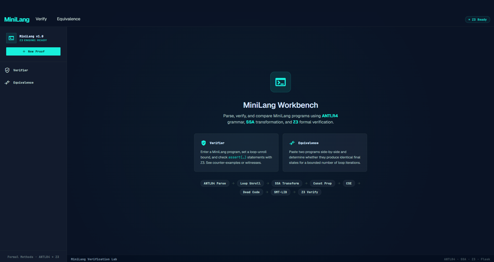
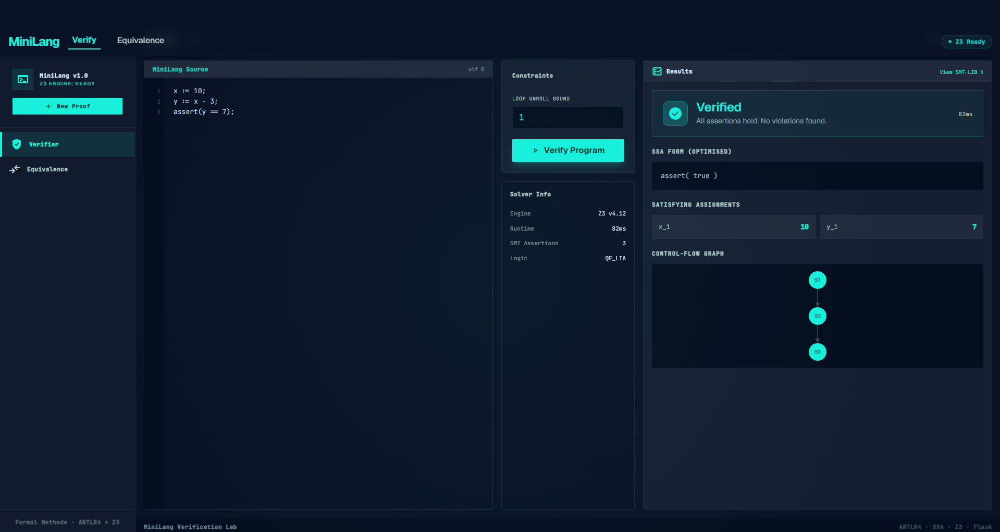
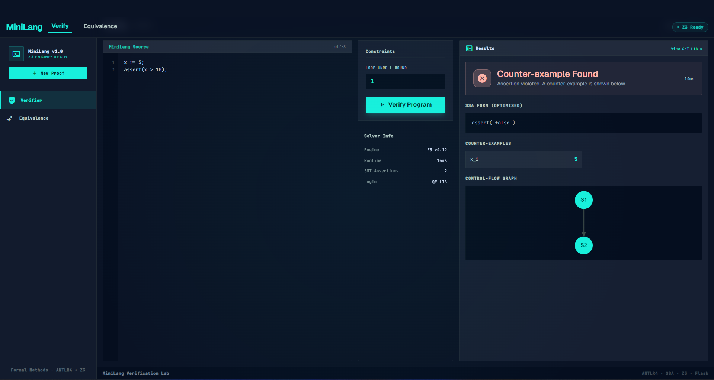
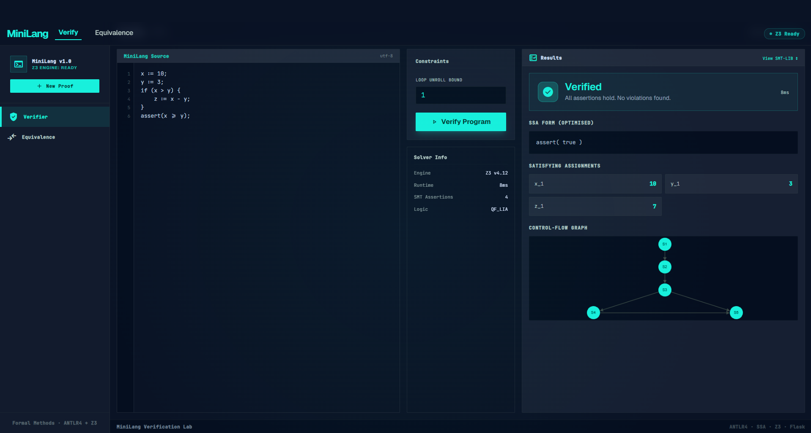
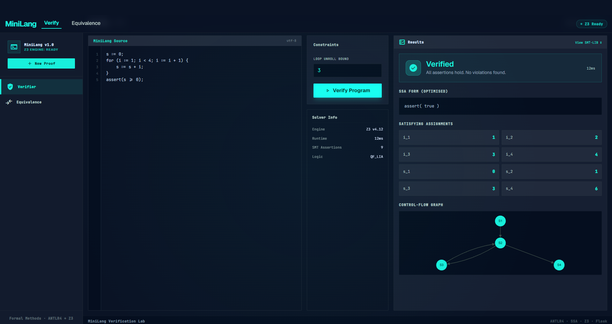
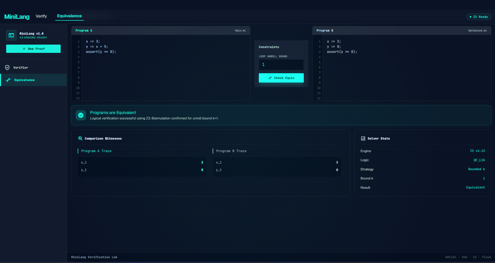
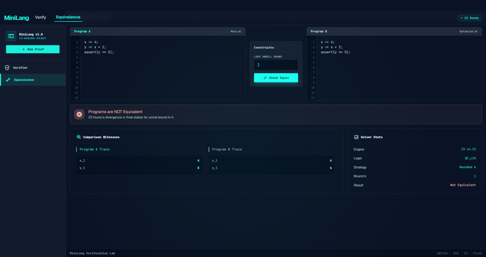

# MiniLang Verification Workbench

A Flask-based workbench for parsing and verifying programs written in MiniLang. The app uses ANTLR4 to parse source code, transforms programs into SSA form, generates SMT-LIB constraints, and uses Z3 to check assertions and bounded program equivalence.

## Live App

https://minilang-verification-workbench.onrender.com

## Features

- Parses MiniLang programs with an ANTLR4 grammar.
- Reports syntax errors from the generated lexer and parser.
- Unrolls `for` and `while` loops with a configurable bound.
- Converts assignments into Static Single Assignment form.
- Applies constant propagation, common subexpression elimination, and dead-code elimination.
- Generates SMT-LIB constraints for integer program reasoning.
- Verifies `assert(...)` statements with Z3.
- Shows counterexamples or witnesses when verification fails or succeeds.
- Builds a control-flow graph for parsed programs.
- Checks bounded equivalence between two MiniLang programs.
- Provides browser pages for verification and equivalence workflows.

## MiniLang Syntax

```text
x := 5;
y := x + 3;

if (x > 2) {
    z := x - 1;
} else {
    z := 0;
}

while (y > 0) {
    y := y - 1;
}

for (i := 0; i < 5; i := i + 1) {
    s := s + i;
}

assert(z >= 0);
```

Supported constructs include integer variables, array access, arithmetic expressions, comparisons, `if`/`else`, `while`, `for`, and `assert`.

## Screenshots

### Welcome Page



### Program Verification Examples









### Program Equivalence Examples






## Tech Stack

| Part | Tech |
| --- | --- |
| Language | Python |
| Web framework | Flask |
| Grammar | ANTLR4 |
| Parser runtime | antlr4-python3-runtime |
| Solver | Z3 |
| Graph model | NetworkX |
| Frontend | Jinja templates, Bootstrap, JavaScript |

## Project Structure

```text
.
|-- MiniLang.g4                  # MiniLang grammar
|-- MiniLangLexer.py             # Generated ANTLR lexer
|-- MiniLangParser.py            # Generated ANTLR parser
|-- MiniLangVisitor.py           # Generated ANTLR visitor base
|-- app.py                       # Flask app and verification pipeline
|-- requirements.txt             # Python dependencies
|-- antlr-4.13.2-complete.jar    # ANTLR tool for parser regeneration
|-- templates/                   # Browser pages
|-- static/                      # CSS and JavaScript assets
|-- assets/                      # README screenshots
`-- README.md
```

## Install Dependencies

Create and activate a virtual environment:

```bash
python -m venv venv
```

Windows:

```bash
venv\Scripts\activate
```

macOS/Linux:

```bash
source venv/bin/activate
```

Install dependencies:

```bash
pip install -r requirements.txt
```

## Run Locally

```bash
python app.py
```

Open:

```text
http://127.0.0.1:5000
```

## Workflows

### Verify A Program

Open `/verify`, enter a MiniLang program, choose an unroll bound, and run the verifier.

The output includes:

- unrolled source
- original SSA form
- optimized SSA form
- SMT-LIB constraints
- verification result
- control-flow graph data

### Check Program Equivalence

Open `/equiv`, enter two MiniLang programs, choose an unroll bound, and run the equivalence checker.

The checker compares bounded final program states with Z3.

## API Endpoints

```text
POST /parse
Body: { "program": "<MiniLang code>", "unroll": <k> }

POST /equiv-api
Body: { "progA": "<MiniLang code>", "progB": "<MiniLang code>", "unroll": <k> }
```

## Regenerate Parser Files

Only needed after editing `MiniLang.g4`:

```bash
java -jar antlr-4.13.2-complete.jar -Dlanguage=Python3 MiniLang.g4
```

## Example Programs

Ready-to-run MiniLang examples for the verification and equivalence workflows. Paste a program into the workbench, set the unroll bound, and run the matching action.

---

### Verify - Example 1: Simple Arithmetic

> **Unroll bound:** 1

```text
x := 10;
y := x - 3;
assert(y == 7);
```

**Expected result:** Verified. Z3 confirms that `y == 7` holds for the generated constraints.  
**Witness:** `x_1 = 10, y_1 = 7`

---

### Verify - Example 2: Failing Assertion

> **Unroll bound:** 1

```text
x := 5;
assert(x > 10);
```

**Expected result:** Counterexample found. The value `x = 5` violates the assertion `x > 10`.  
**Counterexample:** `x_1 = 5`

---

### Verify - Example 3: Conditional Logic

> **Unroll bound:** 1

```text
x := 10;
y := 3;
if (x > y) {
    z := x - y;
}
assert(x >= y);
```

**Expected result:** Verified. The assertion `x >= y` remains true after the conditional branch.  
**Witness:** `x_1 = 10, y_1 = 3, z_1 = 7`

---

### Verify - Example 4: Loop Accumulation

> **Unroll bound:** 3

```text
s := 0;
for (i := 1; i < 4; i := i + 1) {
    s := s + i;
}
assert(s >= 0);
```

**Expected result:** Verified. The bounded loop unroll keeps the accumulated sum non-negative.  
**Witness:** `s reaches 6 after 3 unrolled iterations`

---

### Equivalence - Example 1: Constant Folding

> **Unroll bound:** 1

**Program A** (computed):

```text
x := 3;
y := x + 5;
assert(y == 8);
```

**Program B** (pre-folded):

```text
x := 3;
y := 8;
assert(y == 8);
```

**Expected result:** Equivalent. Both programs produce `y = 8` and satisfy the same assertion.

---

### Equivalence - Example 2: Loop vs Manual Unroll

> **Unroll bound:** 2

**Program A** (loop):

```text
s := 0;
for (i := 1; i < 3; i := i + 1) {
    s := s + i;
}
assert(s == 3);
```

**Program B** (hand-unrolled):

```text
s := 0;
s := s + 1;
s := s + 2;
assert(s == 3);
```

**Expected result:** Equivalent. The loop and the hand-unrolled version both compute `1 + 2 = 3`.

---

### Equivalence - Example 3: Different Results

> **Unroll bound:** 1

**Program A**:

```text
x := 4;
y := x + 1;
assert(y == 5);
```

**Program B**:

```text
x := 4;
y := x + 2;
assert(y == 5);
```

**Expected result:** Not equivalent. Program A satisfies the assertion with `y = 5`, while Program B produces `y = 6`.

---
## Verification Pipeline

```text
MiniLang source
    |
    v
ANTLR4 parser
    |
    v
Loop unrolling
    |
    v
SSA transformation
    |
    v
Optimization passes
    |
    v
SMT-LIB generation
    |
    v
Z3 verification
```
